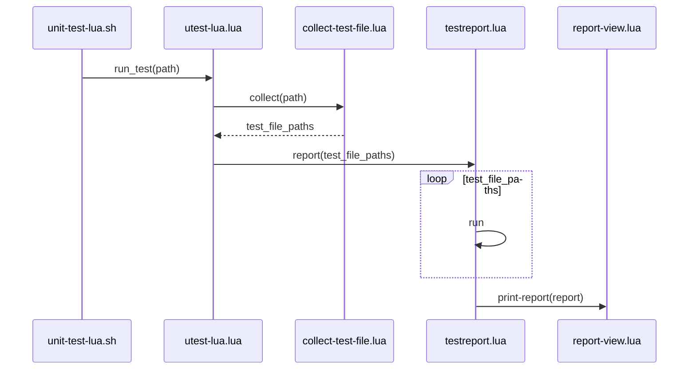

```mermaid
sequenceDiagram

participant unit-test-lua.sh
participant utest-lua.lua
participant collect-test-file.lua
participant testreport.lua
participant report-view.lua

unit-test-lua.sh ->> utest-lua.lua : run_test(path)
utest-lua.lua ->> collect-test-file.lua : collect(path)
collect-test-file.lua -->> utest-lua.lua :test_file_paths
utest-lua.lua ->> testreport.lua:report(test_file_paths)
loop test_file_paths
testreport.lua ->> testreport.lua:run
end
testreport.lua ->> report-view.lua:print-report(report)
```
